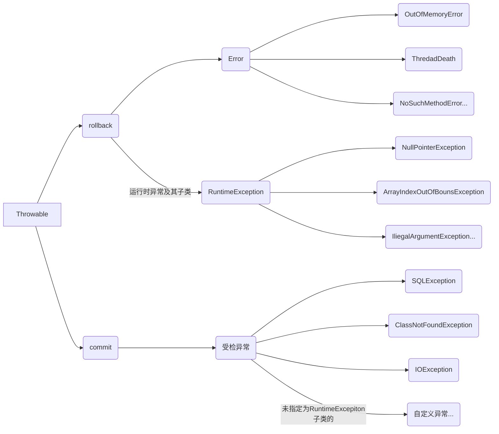

# Eclips &IDEA常用快捷键


| Eclips快捷键          | IDEA快捷键 | 快捷键说明                     |
| --------------------- | ---------- | :----------------------------- |
| Alt + /               |            | 智能提示                       |
| Ctrl + 1              | Alt+Enter  | 快速修复                       |
| ALt + Shift +N        |            | 新建                           |
| Ctrl + W              |            | 关闭当前窗口                   |
| Ctrl  + Shift +W      |            | 关闭所有窗口                   |
| Ctrl + S              |            | 保存                           |
| Ctrl + Shift + S      |            | 保存所有                       |
| Ctrl + F              |            | 在当前文件查找                 |
| Ctrl + H              |            | 在项目中查找                   |
| Ctrl + /              |            | 单行/取消注释                  |
| Ctrl + Shift + /      |            | 块注释                         |
| Ctrl + Shift + \      |            | 取消块注释                     |
| Ctrl + Shift + F      |            | 代码格式化（自动对齐）         |
| Ctrl +Shift + O       |            | 自动导入所有需要的类           |
| Shif + enter          |            | 再当前行下面产生空行           |
| Ctrl + Alt + 向下箭头 |            | 复制一行                       |
| Alt + 向下/上箭头     |            | 移动一行                       |
| Ctrl + D              |            | 删除一行                       |
| Alt + Shift + R       |            | 重命名                         |
| Alt + Shift + M       |            | 把一段代码抽象为一个方法       |
| Alt  + Shift + L      |            | 把一个表达式赋值给一个局部变量 |
| Ctrl + Shift + T      |            | 打开类型                       |
| Ctrl + O              |            | 显示成员                       |
| Ctrl + F11            |            | 运行程序                       |
| F11                   |            | 调试程序                       |
| Ctrl + Shift + B      |            | 添加/取消断点                  |
| Alt + Shift + S       |            | 调出默认重写选择器             |
| Alt + Shift + J       |            | 快速添加文档注释               |


# Final修饰符

1、final 修饰类，表示该类是最终类，不能被集成

System/String/Scanner就是final修饰的类

2、finla修饰字段，字段（Field），也叫成员变量，包括实例变量与静态变量

1）final修饰的字段必须显式的赋值，经常在定义final字段的同事就赋值，

2）final修饰的字段也可以在构造方法中给final 修复师的实例变量赋值

3)final 修饰的字段不能再重新被赋值

4)一般情况下，final 与static 都是同时使用的，覅按了字段所有字母都大写，成为final常量

3、final修饰方法，表示方法不能被子类重写

4、final 修饰局部变量，一旦初始化就不能再被修改，注意final修饰引用类型变量，是指这个引用类型变量不能再指向其他对象，但可以修改它的属性值

5、final 修饰方法的形参，在方法体中，不能修改fina形参的值


# 抽象类

1、对一组对象进行更高一级抽象时，形成抽象类，就可以定义为抽象类

2、普通类有的实例变量/实例方法/静态变量/构造方法等所有成员都可以在抽象类中定义

3、抽象类型也是一种应用数据类型

​		Java数据类型包括基本类型与应用，其中引用类型包括：类，接口，数组，枚举

4、抽象列不能实例化对象，抽象类的应用需要赋值子类对象

5、含有抽象方法的类必须定义为抽象类

6、子类继承了抽象类，子类需要重写抽象类中所有的抽象方法，如果子类没有重写抽象类的所有抽象方法，则子类也必须定义为抽象类

7、抽象类中不一定必须有抽象方法


# 接口

## 接口的定义和使用

1、如何定义接口

​	【修饰符】 Interface 接口名 ｛

​		功能，用方法标识，接口中的方法默认使用 public abstract 修饰

​	｝

2、如何使用接口

​	class  类  implements 接口 {

​		从写接口中的抽象方法

​	}

3、接口中的方法默认使用 public abstract 修饰

4、就扣不能实例化对象

5、接口引用需要赋值视线里对象

6、通过接口引用，调用接口的抽象方法，实际上是执行的实现类对象的方法，这是接口的多态

7、接口的引用，可以赋值匿名对象

PS：

1、接口中方法默认使用 public abstract 修饰，接口中还可以定义public static final 常量，public static 方法， public default 方法

2、类实现了接口，需要重写接口的抽象方法，如果没有重写接口中所有的抽象方法，实现类需要定义为抽象类

3、接口是一种引用数据类型，可以定义变量，但接口不能实例化对象，接口的引用需要赋实现类对象，或者接口的匿名内部类对象

4、接口多态，接口应用调用接口中的抽象方法，实际上执行的是实现类对象的方法，接口存在就是为了实现多态

5、一个类可以同时实现多个接口，需要重写所有接口的抽象方法

6、接口也支持集成，并且接口支持多继承

## 接口与抽象类的异同点

相同点：

​	1）都可以定义抽象方法

​	2）都不能实例化对象

​	3）定义的抽象方法都需要被重写

​	4）都可以定义 public static 方法，public static final 常量

不同点：

​	1）意义不同

​			抽象类是对事物更高层级的抽象

​			接口是对功能的封装

​	2）定义方式不同

​		抽象类用 abstract class 定义

​		接口用 interface 定义

​	3）内容不同

​		抽象类中除了抽象放放外，还可以定义构造方法等比普通类中定义的所有成员

​		接口除了抽象类方法这四个内同外，不能定义构造防范等内容
​	4）使用方式不同

​		抽象类需要被子类继承 extends

​		接口需要别实现类实现 implements

​	5）类只支持单继承，接口支持多继承

​	6）应用场景不同

​		一般情况向，对类进行功能的廓镇，优先选择接口

​		除了扩展功能外，还需要保存不同的数据，只能选择抽象类；抽象类的抽象方法需要子类重写，抽象类还可以约束所有的子类都具有相同的功能


## 接口的应用

1、接口用来封装功能（操作）

2、接口可以定义一族操作规范

# 类

类与类之间的关系

1、泛化（继承）

​	一个类继承另外一个类，一个接口继承另外一个接口

2、实现

​	一个类实现接口

3、依赖

​	一个A类的方法返回值类型，方法参数类型或者是局部变量类型使用另外一个B类，成为A类依赖B类

4、关联

​	如果A类使用B类定义了成员变量，就称A类关联了B类

5、聚合、

​	聚合是关联的一种，如果一个类A是有若干的B类组成的并且不能决定B类的生命周期，则成A类为聚合类

6、组合

​	组合是关联的一种，如果一个类A是由若干的B类组成的并且可以决定B的声明周期，则称A类为组合

7、其他关系

​	is a： A类 is a B 类 （子类 is a 父类），是集成关系，也只有两个类符合is a关系是才能使用集成

​	like a：类 like a 接口，是实现关系

​	has a： A类 has a B类，关联关系

# 异常

## Throws抛出处理

在定义方法是，如果方法体重有受检异常需要预处理，可以捕获处理，也可以抛出处理。

谁调用这个放放，谁负责处理该异常。

在定义方法时，把异常抛出就是为了提醒方法使用者，有异常需要预处理。


在处理异常时，是选择捕获处理还是抛出处理？

​	1、一般情况下，在调用其他方法是，如果被调用的方法有收件异常需要预处理，选择捕获处理

​	2、在定义方法时，如果方法体重有受检异常要处理，可以选择捕获，也可以选择抛出处理；如果方法体中中通过throw 语句抛出了一个异常对象，所在的方法应该使用throws声明该对象

## 方法覆盖中的异常处理


1、方法覆盖（重写）规则

​	1）方法签名必须相同，方法与参数列表就是方法签名

​	2）方法的返回类型可以想通，子类方法的返回值类型可以是父类方法返回类型的子类型

​	3）子类方法到的访问权限可以更宽泛（更大）

​		a）如果父类方法使用 public 修饰，子类方法只能用public修饰

​		b）如果父类方法使用protected修饰，自乐方法可以是protected/public修饰

​	4）子类方法的异常要比父类方法的异常更小

​		a）如果父类方法没有抛出异常，子类重写后也不能抛出异常

​		b）如果父类方法抛出了异常，子类方法可以抛出相同的异常，也可以抛出父类异常的子类异常，也可以不抛出异常

2、异常在开发中的应用

​	1）自定义异常

​		a）定义一个类集成Exception

​		b）在自定义异常中提供两个构造函数，无参构造和带String的有参构造

​		c）在需要的位置通过throw抛出异常对象

​		d）throw所在的方法通过throws声明该异常

​		e）调用方法时，需要对受检异常预处理

# 数组

## 一维数组的定义与访问

1、定义

​	数据类型 [] 数组名 = new 数据类型[素组的长度];

​	说明：

​		1）数据类型就是素组中存袁术的数据类型

​		2）方括弧就是定义的是数组

​		3）数组名其实就是一个变量名，报春数组的引用（数组的其实地址）

​		4）new运算符会在对重分配一块连续的存储空间，把这块连续的存储空间的应用（起始地址）保存到数组名中
​		5）数组本质上就是堆中的一块连续空间

​	2、使用

​		通过索引值访问数组的元素

​			定义一数组后，系统为每个袁术指定一个索引值，索引值从0开始的

## 数组扩容

​	当定义了数据之后，数组的长度就确定了，即数组存储的元素个数就确定了，如果想要在数组中保存更多的数据，就需要对数组进行扩容

​	数组扩容：

​		1）定义一个更大的数组

​		2）将原来数组的内容复制到新的数组总

​		3）将原来的数组名指向新的数组

## 数组的特点：

​	1、优点：

​			a）数组可以通过索引（下标）可以实现素组元素的随机方位

​	2、缺点：

​		a）想数组中添加/删除元素的效率比较低

​	3、应用场景

​		a）已查询访问为主，很少进行添加/删除时,选择数组存储这些数据

## Arrays工具类

​	1、static <T>  List <T> asList(T... a) 可以把数组转换为List列表

​	2、static int  binarySearch(int[] a , int key) 在数组a中查找元素key，返回可在数组中的索引值，如果数组中不存在该元素返回负数。


# 集合

## Collection集合概述

1、集合是用来存储引用类型数据的容器

2、集合主要分为两大类：

​	Collection集合：村粗数据时是单个存储

​	Map集合：是按<key， value> 对的形式存取数据

3、基础包：java.util.Collection


# IO流

## 概述

1、流是有起点和终点的有序字节序列

2、流的分类

​	输入/输出流，是当前程序为参照，程序从外面读数据为输入流，把程序的数据保存到外面是输出流

​	字节流/字符流，如果是以字节为代为处理流中的数据，就是字节流，如果是以字符为代为处理流中的数据就是字符流

​	节点流/处理流，如果直接从设备（数据源）上读写数据就是节点流，处理流是对节点流的包装

3、IO流

​	在程序中从文件读写数据需要使用IO流，Java定义了相关的流类，java.io包中：

​		如果资格类是以Stream单词结尾就是字节流类

​		如果已Reader结尾就是字符输入流类

​		如果已Writer单词结尾就是字符输出流

## FileInputStream/FileOutputStream

​	1、以字节为单位读写内容

## FileReader/FileWriter

​	1、以字符为单位读写文件

​	2、只能读写纯文本文件

​	3、要求文本文件的编码格式要与当前的环境编码格式兼容


# Spring的事务管理器

## 1、接口：

​	1.1事务管理器是PlatformTransactionManager接口

​	在接口中定义了事务的主要方法：

​		commit()：事务提交

​		rollback()：事务回滚

   事务管理里器接口的实现类：

​		1）DataSourceTransactionManager：在使用jdbc或者mybatis访问数据库时使用的。

​			在spring中创建DataSourceTransactionManager 使用<bean>

~~~xml
<bean id="myDataSource" class="xxx包.DataSourceTransactionManager">
	<!-必须指定数据源DataSource-->
</bean>
~~~

​		2）HibernateTransactionManager:在项目中使用hibernate框架时，使用的实现类

​	1.2事务的定义接口：TransactionDefinition

​		1、作用：定义了控制和管理事务的一些常量值。
​			    指定事务的属性（控制事务是什么样的，怎么操作的）

​			1)事务的隔离级别：ISOLATION_*（5个隔离级别）
​				DEFAULT：采用DB默认的事务隔离级别。
​						MySql的默认级别为ERPEATABLE_READ
​						ORACLE默认级别为READ_COMMITTED
​				READ_UNCOMMITTED:读未提交。未解决任何并发问题。
​				READ_COMMITTED：读已提交。解决脏读，存在不可重复读与幻读。
​				ERPEATABLE_READ：可重复读。解决脏读，不可重复读，存在幻读。
​				SERIALIZABLE：

​			2)事务传播行为：事务在方法之间传递，方法怎么使用事务。

​					通过传播行为指定方法怎么使用事务。

​					7种传播行为：PROPAGATION_*

​						PROPAGATION_REQUIRED：

​								指定的方法必须在事务内执行。

​								若存在事务，就加入到当前的事务中；若当前没有事务，则创建一个新的事务。

​								这种传播行为是最常见的选择，也是spring默认的事务传播行为

​						PROPAGATION_REQUIRED_NEW：

​								总是新建一个事务。

​								若当前存在事务，就将当前事务挂起，知道新事物执行完毕。

​						PROPAGATION_SUPPORTS：

​								指定的方法支持当前事务，但若当前没有事务，也可以已非事务方式执行。

​						PROPAGATION_MANDATORY：

​						PROPAGATION_NESTED：

​						PROPAGATION_NEVER：

​						PROPAGATION_NOT_SUPPORTED：

​			3）事务的超时：TIMEOUT_*（秒为单位，默认为-1，使用数据库自己的默认超时时间）

​				超时：指事务的最长执行时间，也就是一个方法的最长执行时间。

​					  当时间到了，方法没有执行完毕，spring回滚方法的执行

## 2、Spring的回滚方式

​	Spring事务的默认回滚方式是：发生运行时异常和error是回滚，发生受查（编译）异常时提交。





## 3、spring的事务注解管理事务

### 3.1异常注解

```javascript
@Transactional的所有可选属性:
		propagation：用户设置事务传播的属性。该属性类型为Propagation枚举，默认值为Propagation.REQUIRED
		isolation：用于事务的隔离级别。该属性类型为Isolation枚举，默认值为Isolation.DEFAULT
		readOnly：用于设置该方法对数据库的操作是否是只读的。该苏醒为boolean，默认值为false
         timeout：用于设置本操作与数据库连接的超时时限。单位为秒，类型为int，默认值为-1，及没有时限
         rollbackFor：指定需要回滚的异常类。类型为Class[]，默认值为空数组。若只有一个异常时，可以不使用数组
         rollbackForClassName：指定需要回滚的异常类类名。类型为String[]，默认空数组。一个异常类时，可不用数组
         noRollbackFor：指定不需要回滚的异常类。类型为Class[]，默认值为空数组。只有一个异常类时，可不用数组
         noRollbackForClassName:指定不需要回滚的异常类类名。类型为String[]，默认空数组。
         
```


### 	3.2注意：

​			1、@Transactional用在方法上时，只能用于public方法上
​			2、@Transaction用在类上，则表示该雷伤所有的方法均将在执行时织入事务

### 	3.3使用步骤

​		1、声明事务管理器
​		2、声明事务注解驱动
​		3、业务层public方法加入事务管理注解