# Flowchart
Code:
```markdown
graph TD;
    A-->B;
    A-->C;
    B-->D;
    C-->D;
```

# Sequence diagram
Code:
```markdown
sequenceDiagram
    participant Alice
    participant Bob
    Alice->>John: Hello John, how are you?
    loop Healthcheck
        John->>John: Fight against hypochondria
    end
    Note right of John: Rational thoughts <br/>prevail!
    John-->>Alice: Great!
    John->>Bob: How about you?
    Bob-->>John: Jolly good!
```

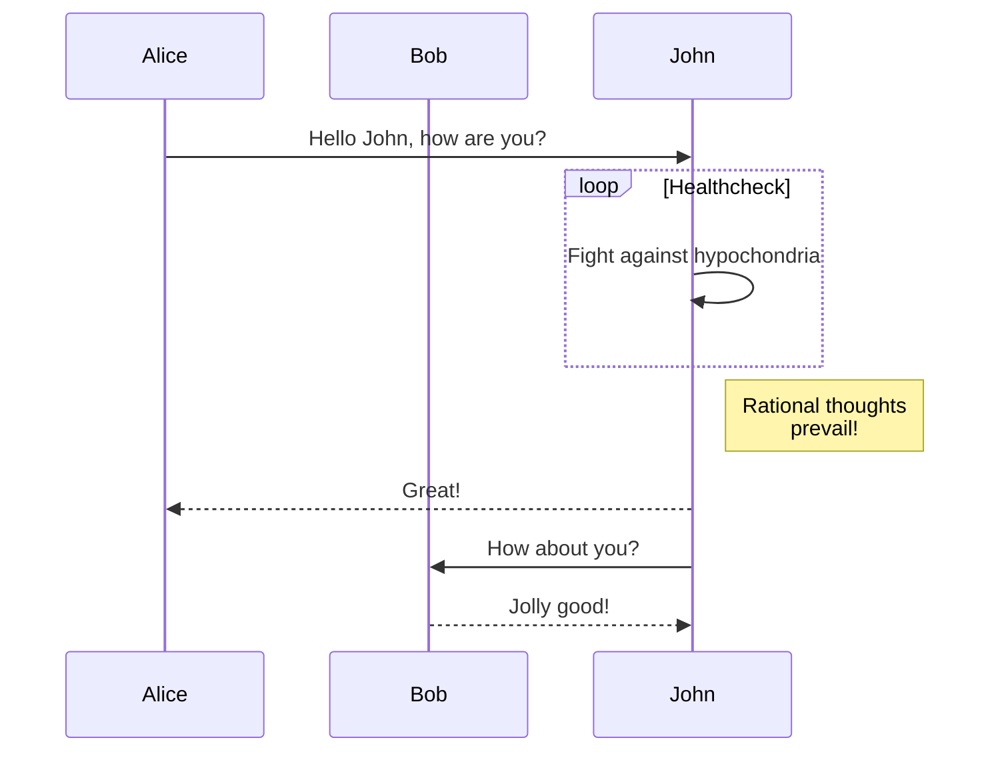
# Gantt diagram
Code:
```markdown
gantt
dateFormat  YYYY-MM-DD
title Adding GANTT diagram to mermaid
excludes weekdays 2014-01-10

section A section
Completed task            :done,    des1, 2014-01-06,2014-01-08
Active task               :active,  des2, 2014-01-09, 3d
Future task               :         des3, after des2, 5d
Future task2               :         des4, after des3, 5d
```
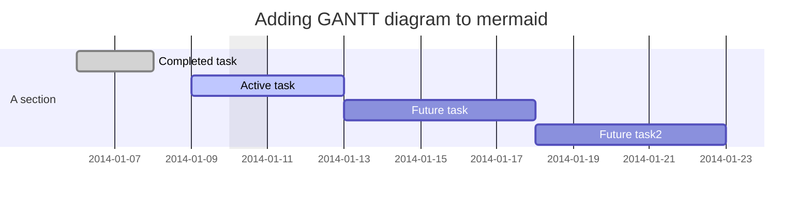

# Class diagram
Code:
```markdown
classDiagram
Class01 <|-- AveryLongClass : Cool
Class03 *-- Class04
Class05 o-- Class06
Class07 .. Class08
Class09 --> C2 : Where am i?
Class09 --* C3
Class09 --|> Class07
Class07 : equals()
Class07 : Object[] elementData
Class01 : size()
Class01 : int chimp
Class01 : int gorilla
Class08 <--> C2: Cool label
```
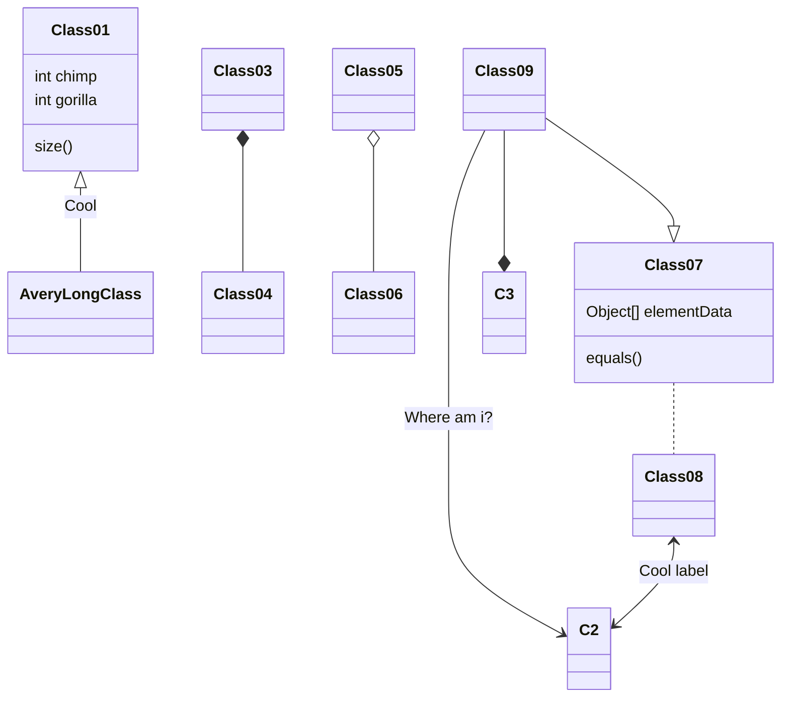
# Git graph
Code:
```markdown
gitGraph
       commit
       commit
       branch develop
       commit
       commit
       commit
       checkout main
       commit
       commit
```

# Entity Relationship Diagram - ❗ experimental
Code:
```markdwon
erDiagram
    CUSTOMER ||--o{ ORDER : places
    ORDER ||--|{ LINE-ITEM : contains
    CUSTOMER }|..|{ DELIVERY-ADDRESS : uses
```
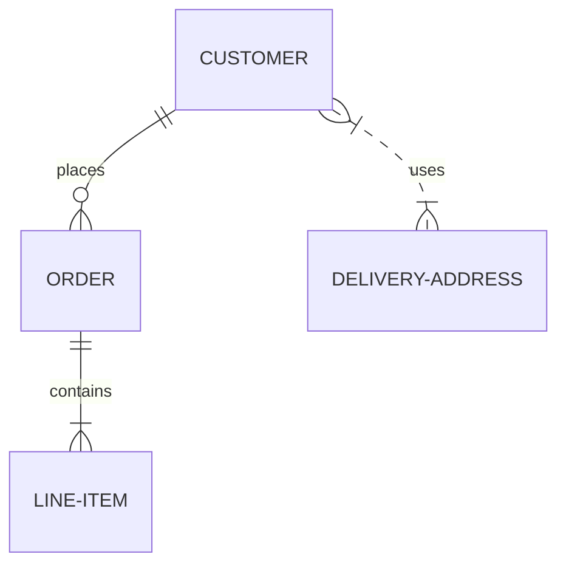

# User Journey Diagram
Code:
```markdown
journey
    title My working day
    section Go to work
      Make tea: 5: Me
      Go upstairs: 3: Me
      Do work: 1: Me, Cat
    section Go home
      Go downstairs: 5: Me
      Sit down: 5: Me
```
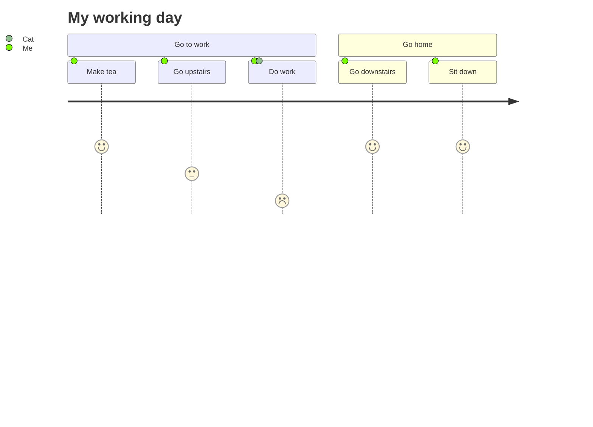
# Gantt diagrams
## A note to users
```markdown
gantt
    title A Gantt Diagram
    dateFormat YYYY-MM-DD
    section Section
        A task          :a1, 2014-01-01, 30d
        Another task    :after a1, 20d
    section Another
        Task in Another :2014-01-12, 12d
        another task    :24d
```
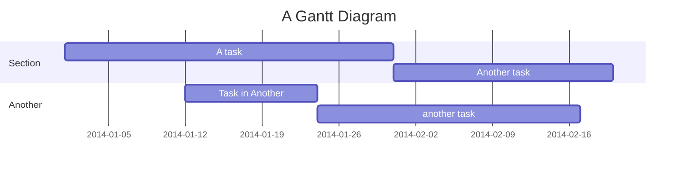
## Syntax
```markdown
gantt
    dateFormat  YYYY-MM-DD
    title       Adding GANTT diagram functionality to mermaid
    excludes    weekends
    %% (`excludes` accepts specific dates in YYYY-MM-DD format, days of the week ("sunday") or "weekends", but not the word "weekdays".)

    section A section
    Completed task            :done,    des1, 2014-01-06,2014-01-08
    Active task               :active,  des2, 2014-01-09, 3d
    Future task               :         des3, after des2, 5d
    Future task2              :         des4, after des3, 5d

    section Critical tasks
    Completed task in the critical line :crit, done, 2014-01-06,24h
    Implement parser and jison          :crit, done, after des1, 2d
    Create tests for parser             :crit, active, 3d
    Future task in critical line        :crit, 5d
    Create tests for renderer           :2d
    Add to mermaid                      :1d
    Functionality added                 :milestone, 2014-01-25, 0d

    section Documentation
    Describe gantt syntax               :active, a1, after des1, 3d
    Add gantt diagram to demo page      :after a1  , 20h
    Add another diagram to demo page    :doc1, after a1  , 48h

    section Last section
    Describe gantt syntax               :after doc1, 3d
    Add gantt diagram to demo page      :20h
    Add another diagram to demo page    :48h
```
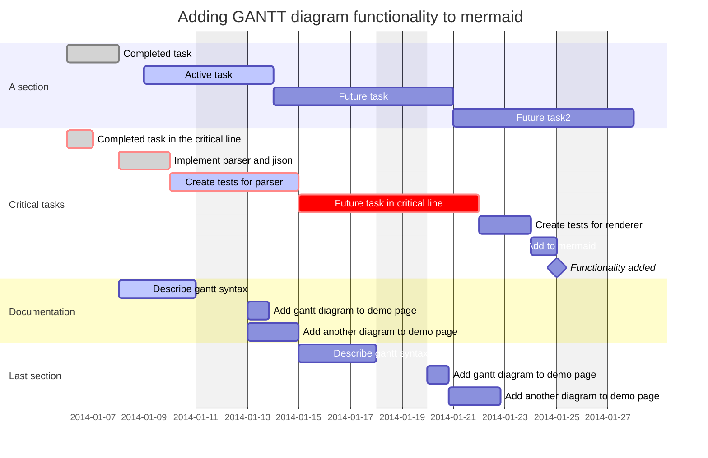
## multiple dependencies
```markdown 
gantt
    apple :a, 2017-07-20, 1w
    banana :crit, b, 2017-07-23, 1d
    cherry :active, c, after b a, 1d
```
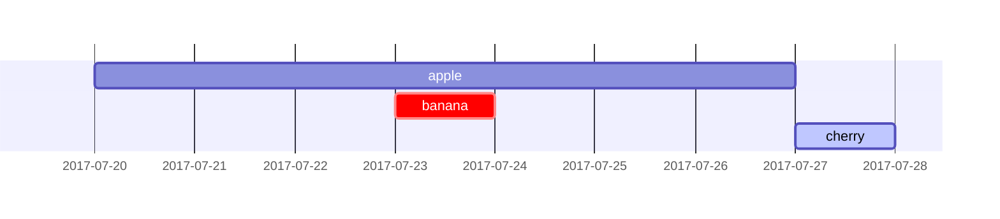

## Milestones
```markdown
gantt
    dateFormat HH:mm
    axisFormat %H:%M
    Initial milestone : milestone, m1, 17:49, 2m
    Task A : 10m
    Task B : 5m
    Final milestone : milestone, m2, 18:08, 4m
```
```mermaid
gantt
    dateFormat HH:mm
    axisFormat %H:%M
    Initial milestone : milestone, m1, 17:49, 2m
    Task A : 10m
    Task B : 5m
    Final milestone : milestone, m2, 18:08, 4m
```
# Setting dates
> dateFormat defines the format of the date input of your gantt elements. How these dates are represented in the rendered chart output are defined by axisFormat.
## Input date format
> The default input date format is YYYY-MM-DD. You can define your custom dateFormat.
```markdown
dateFormat YYYY-MM-DD
```
|Input		|Example		|Description											|
|:-:		|:-:			|:-:													|
|YYYY		|2014			|4 digit year											|
|YY			|14				|2 digit year											|
|Q			|1..4			|Quarter of year. Sets month to first month in quarter.	|
|M MM		|1..12			|Month number											|
|MMM MMMM	|January..Dec	|Month name in locale set by dayjs.locale()				|
|D DD		|1..31			|Day of month											|
|Do			|1st..31st		|Day of month with ordinal								|
|DDD DDDD	|1..365			|Day of year											|
|X			|1410715641		|Unix timestamp											|
|x			|1.41072E+12	|Unix ms timestamp										|
|H HH		|0..23			|24 hour time											|
|h hh		|1..12			|12 hour time used with a A.							|
|a A		|am pm			|Post or ante meridiem									|
|m mm		|0..59			|Minutes												|
|s ss		|0..59			|Seconds												|
|S			|0..9			|Tenths of a second										|
|SS			|0..99			|Hundreds of a second									|
|SSS		|0..999			|Thousandths of a second								|
|Z ZZ		|+12:00			|Offset from UTC as +-HH:mm, +-HHmm, or Z				|

## Output date format on the axis
> The default output date format is YYYY-MM-DD. You can define your custom axisFormat, like 2020-Q1 for the first quarter of the year 2020.

```markdown
axisFormat %Y-%m-%d
```
|Format	|Definition																					|
|:-:	|:-:																						|
|%a		|abbreviated weekday name																	|
|%A		|full weekday name																			|
|%b		|abbreviated month name																		|
|%B		|full month name																			|
|%c		|date and time, as "%a %b %e %H:%M:%S %Y"													|
|%d		|zero-padded day of the month as a decimal number [01,31]									|
|%e		|space-padded day of the month as a decimal number [ 1,31]; equivalent to %_d				|
|%H		|hour (24-hour clock) as a decimal number [00,23]											|
|%I		|hour (12-hour clock) as a decimal number [01,12]											|
|%j		|day of the year as a decimal number [001,366]												|
|%m		|month as a decimal number [01,12]															|
|%M		|minute as a decimal number [00,59]															|
|%L		|milliseconds as a decimal number [000, 999]												|
|%p		|either AM or PM																			|
|%S		|second as a decimal number [00,61]															|
|%U		|week number of the year (Sunday as the first day of the week) as a decimal number [00,53]	|
|%w		|weekday as a decimal number [0(Sunday),6]													|
|%W		|week number of the year (Monday as the first day of the week) as a decimal number [00,53]	|
|%x		|date, as "%m/%d/%Y"																		|
|%X		|time, as "%H:%M:%S"																		|
|%y		|year without century as a decimal number [00,99]											|
|%Y		|year with century as a decimal number														|
|%Z		|time zone offset, such as "-0700"															|
|%%		|a literal "%" character																	|

# Axis ticks
> The default output ticks are auto. You can custom your tickInterval, like 1day or 1week.
```markdown
tickInterval 1day
```
The pattern is:
```markdown
/^([1-9][0-9]*)(minute|hour|day|week|month)$/;
```
> Week-based tickIntervals start the week on sunday by default. If you wish to specify another weekday on which the tickInterval should start, use the weekday option:
```markdown
gantt
  tickInterval 1week
  weekday monday
```

```mermaid
gantt
  tickInterval 1week
  weekday monday
```

## Output in compact mode
> The compact mode allows you to display multiple tasks in the same row. Compact mode can be enabled for a gantt chart by setting the display mode of the graph via preceeding YAML settings.
```markdown
---
displayMode: compact
---
gantt
    title A Gantt Diagram
    dateFormat  YYYY-MM-DD

    section Section
    A task           :a1, 2014-01-01, 30d
    Another task     :a2, 2014-01-20, 25d
    Another one      :a3, 2014-02-10, 20d
```
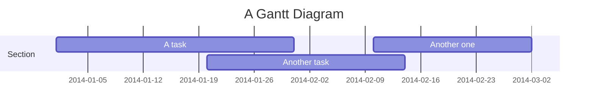
## Comments
> Comments can be entered within a gantt chart, which will be ignored by the parser. Comments need to be on their own line and must be prefaced with %% (double percent signs). Any text after the start of the comment to the next newline will be treated as a comment, including any diagram syntax.
```markdown 
gantt
    title A Gantt Diagram
    %% This is a comment
    dateFormat YYYY-MM-DD
    section Section
        A task          :a1, 2014-01-01, 30d
        Another task    :after a1, 20d
    section Another
        Task in Another :2014-01-12, 12d
        another task    :24d
```

# Styling
> Styling of the Gantt diagram is done by defining a number of CSS classes. During rendering, these classes are extracted from the file located at src/diagrams/gantt/styles.js
## Classes used
|Class					|Description															|
|:-:					|:-:																	|
|grid.tick				|Styling for the Grid Lines												|
|grid.path				|Styling for the Grid's borders											|
|.taskText				|Task Text Styling														|
|.taskTextOutsideRight	|Styling for Task Text that exceeds the activity bar towards the right.	|
|.taskTextOutsideLeft	|Styling for Task Text that exceeds the activity bar, towards the left.	|
|todayMarker			|Toggle and Styling for the "Today Marker"								|
## Sample stylesheet
```css
.grid .tick {
  stroke: lightgrey;
  opacity: 0.3;
  shape-rendering: crispEdges;
}
.grid path {
  stroke-width: 0;
}

#tag {
  color: white;
  background: #fa283d;
  width: 150px;
  position: absolute;
  display: none;
  padding: 3px 6px;
  margin-left: -80px;
  font-size: 11px;
}

#tag:before {
  border: solid transparent;
  content: ' ';
  height: 0;
  left: 50%;
  margin-left: -5px;
  position: absolute;
  width: 0;
  border-width: 10px;
  border-bottom-color: #fa283d;
  top: -20px;
}
.taskText {
  fill: white;
  text-anchor: middle;
}
.taskTextOutsideRight {
  fill: black;
  text-anchor: start;
}
.taskTextOutsideLeft {
  fill: black;
  text-anchor: end;
}
```
# Today marker
You can style or hide the marker for the current date. To style it, add a value for the todayMarker key.

todayMarker stroke-width:5px,stroke:#0f0,opacity:0.5
To hide the marker, set todayMarker to off.

todayMarker off

# Configuration
> It is possible to adjust the margins for rendering the gantt diagram.

> This is done by defining the ganttConfig part of the configuration object. How to use the CLI is described in the mermaidCLI page.

> mermaid.ganttConfig can be set to a JSON string with config parameters or the corresponding object.

```javascript
mermaid.ganttConfig = {
  titleTopMargin: 25,
  barHeight: 20,
  barGap: 4,
  topPadding: 75,
  sidePadding: 75,
};
```
## Possible configuration params:
|Param			|Description																																|Default value	|
|:-:			|:-:																																		|:-:			|
|mirrorActor	|Turns on/off the rendering of actors below the diagram as well as above it																	|FALSE			|
|bottomMarginAdj|Adjusts how far down the graph ended. Wide borders styles with css could generate unwanted clipping which is why this config param exists.	|1				|

# Interaction
> It is possible to bind a click event to a task. The click can lead to either a javascript callback or to a link which will be opened in the current browser tab. Note: This functionality is disabled when using securityLevel='strict' and enabled when using securityLevel='loose'.
click taskId call callback(arguments)
click taskId href URL
taskId is the id of the task
callback is the name of a javascript function defined on the page displaying the graph, the function will be called with the taskId as the parameter if no other arguments are specified.
Beginner's tip—a full example using interactive links in an html context:
```html
<body>
  <pre class="mermaid">
    gantt
      dateFormat  YYYY-MM-DD

      section Clickable
      Visit mermaidjs         :active, cl1, 2014-01-07, 3d
      Print arguments         :cl2, after cl1, 3d
      Print task              :cl3, after cl2, 3d

      click cl1 href "https://mermaidjs.github.io/"
      click cl2 call printArguments("test1", "test2", test3)
      click cl3 call printTask()
  </pre>

  <script>
    const printArguments = function (arg1, arg2, arg3) {
      alert('printArguments called with arguments: ' + arg1 + ', ' + arg2 + ', ' + arg3);
    };
    const printTask = function (taskId) {
      alert('taskId: ' + taskId);
    };
    const config = {
      startOnLoad: true,
      securityLevel: 'loose',
    };
    mermaid.initialize(config);
  </script>
</body>
```

# Examples
## Bar chart (using gantt chart)
```markdown 
gantt
    title Git Issues - days since last update
    dateFormat X
    axisFormat %s
    section Issue19062
    71   : 0, 71
    section Issue19401
    36   : 0, 36
    section Issue193
    34   : 0, 34
    section Issue7441
    9    : 0, 9
    section Issue1300
    5    : 0, 5
```

```mermaid
gantt
    title Git Issues - days since last update
    dateFormat X
    axisFormat %s
    section Issue19062
    71   : 0, 71
    section Issue19401
    36   : 0, 36
    section Issue193
    34   : 0, 34
    section Issue7441
    9    : 0, 9
    section Issue1300
    5    : 0, 5
```
