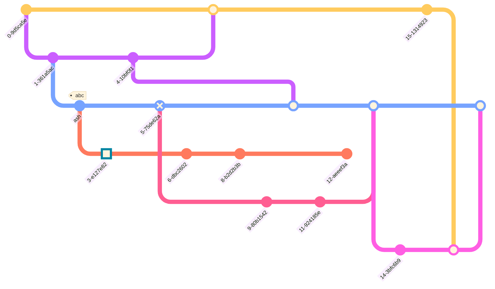
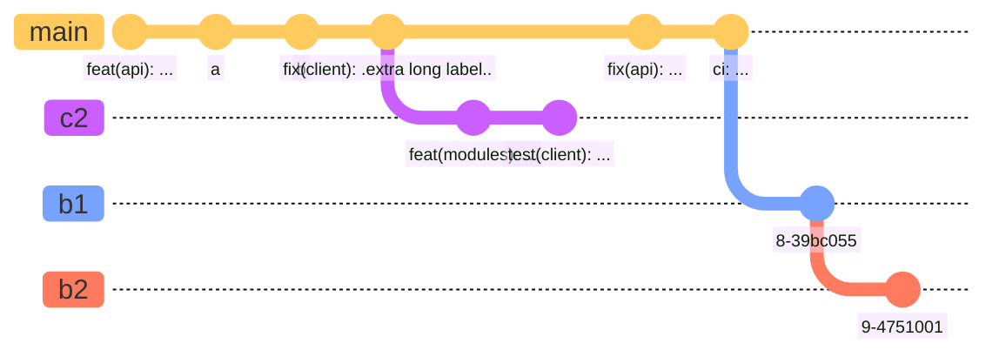

# Cherry Pick commit from another branch
Similar to how 'git' allows you to cherry-pick a commit from **another branch** onto the current branch, Mermaid also supports this functionality. You can also `cherry-pick` a commit from another branch using the cherry-pick keyword.

To use the `cherry-pick` keyword, you must specify the id using the `id` attribute, followed by `:` and your desired commit id within a `""` quote. For example:

`cherry-pick id: "your_custom_id"`

Here, a new commit representing the cherry-pick is created on the current branch, and is visually highlighted in the diagram with a **cherry** and a tag depicting the commit id from which it is cherry-picked from.

A few important rules to note here are:

1. You need to provide the `id` for an existing commit to be cherry-picked. If given commit id does not exist it will result in an error. For this, make use of the `commit id:$value `format of declaring commits. See the examples from above.
2. The given commit must not exist on the current branch. The cherry-picked commit must always be a different branch than the current branch.
3. Current branch must have at least one commit, before you can cherry-pick, otherwise it will cause an error is throw.
Let see an example:
## Code:
```markdown
gitGraph
       commit id: "ZERO"
       branch develop
       commit id:"A"
       checkout main
       commit id:"ONE"
       checkout develop
       commit id:"B"
       checkout main
       commit id:"TWO"
       cherry-pick id:"A"
       commit id:"THREE"
       checkout develop
       commit id:"C"
```

# Gitgraph specific configuration options
In Mermaid, you have the option to configure the gitgraph diagram. You can configure the following options:

* `showBranches` : Boolean, default is `true`. If set to `false`, the branches are not shown in the diagram.
* `showCommitLabel` : Boolean, default is `true`. If set to `false`, the commit labels are not shown in the diagram.
* `mainBranchName` : String, default is `main`. The name of the default/root branch.
* `mainBranchOrder` : Position of the main branch in the list of branches. default is 0, meaning, by default `main` branch is the first in the order.
Let's look at them one by one.
# Hiding Branch names and lines
Sometimes you may want to hide the branch names and lines from the diagram. You can do this by using the `showBranches` keyword. By default its value is `true`. You can set it to `false` using directives.

Usage example:
## Code:
```markdown
%%{init: { 'logLevel': 'debug', 'theme': 'base', 'gitGraph': {'showBranches': false}} }%%
      gitGraph
        commit
        branch hotfix
        checkout hotfix
        commit
        branch develop
        checkout develop
        commit id:"ash" tag:"abc"
        branch featureB
        checkout featureB
        commit type:HIGHLIGHT
        checkout main
        checkout hotfix
        commit type:NORMAL
        checkout develop
        commit type:REVERSE
        checkout featureB
        commit
        checkout main
        merge hotfix
        checkout featureB
        commit
        checkout develop
        branch featureA
        commit
        checkout develop
        merge hotfix
        checkout featureA
        commit
        checkout featureB
        commit
        checkout develop
        merge featureA
        branch release
        checkout release
        commit
        checkout main
        commit
        checkout release
        merge main
        checkout develop
        merge release
```

# Commit labels Layout: Rotated or Horizontal
Mermaid supports two types of commit labels layout. The default layout is **rotated**, which means the labels are placed below the commit circle, rotated at 45 degrees for better readability. This is particularly useful for commits with long labels.

The other option is **horizontal**, which means the labels are placed below the commit circle centred horizontally, and are not rotated. This is particularly useful for commits with short labels.

You can change the layout of the commit labels by using the `rotateCommitLabel` keyword in the directive. It defaults to `true`, which means the commit labels are rotated.

Usage example: Rotated commit labels

## Code:
```markdown
%%{init: { 'logLevel': 'debug', 'theme': 'base', 'gitGraph': {'rotateCommitLabel': true}} }%%
gitGraph
  commit id: "feat(api): ..."
  commit id: "a"
  commit id: "b"
  commit id: "fix(client): .extra long label.."
  branch c2
  commit id: "feat(modules): ..."
  commit id: "test(client): ..."
  checkout main
  commit id: "fix(api): ..."
  commit id: "ci: ..."
  branch b1
  commit
  branch b2
  commit
```


Usage example: Horizontal commit labels

## Code:
```markdown
%%{init: { 'logLevel': 'debug', 'theme': 'base', 'gitGraph': {'rotateCommitLabel': false}} }%%
gitGraph
  commit id: "feat(api): ..."
  commit id: "a"
  commit id: "b"
  commit id: "fix(client): .extra long label.."
  branch c2
  commit id: "feat(modules): ..."
  commit id: "test(client): ..."
  checkout main
  commit id: "fix(api): ..."
  commit id: "ci: ..."
  branch b1
  commit
  branch b2
  commit
```
