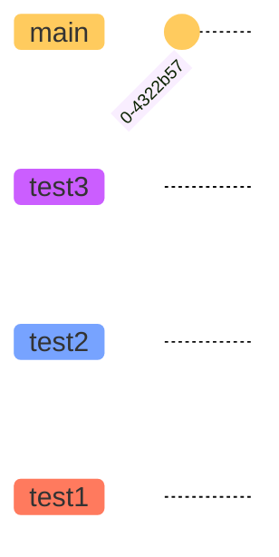

# Hiding commit labels
Sometimes you may want to hide the commit labels from the diagram. You can do this by using the `showCommitLabel` keyword. By default its value is `true`. You can set it to `false` using directives.

Usage example:
## Code:
```markdown 
%%{init: { 'logLevel': 'debug', 'theme': 'base', 'gitGraph': {'showBranches': false,'showCommitLabel': false}} }%%
      gitGraph
        commit
        branch hotfix
        checkout hotfix
        commit
        branch develop
        checkout develop
        commit id:"ash"
        branch featureB
        checkout featureB
        commit type:HIGHLIGHT
        checkout main
        checkout hotfix
        commit type:NORMAL
        checkout develop
        commit type:REVERSE
        checkout featureB
        commit
        checkout main
        merge hotfix
        checkout featureB
        commit
        checkout develop
        branch featureA
        commit
        checkout develop
        merge hotfix
        checkout featureA
        commit
        checkout featureB
        commit
        checkout develop
        merge featureA
        branch release
        checkout release
        commit
        checkout main
        commit
        checkout release
        merge main
        checkout develop
        merge release
```

# Customizing main branch name
Sometimes you may want to customize the name of the main/default branch. You can do this by using the `mainBranchName` keyword. By default its value is `main`. You can set it to any string using directives.

Usage example:
## Code:
```markdown
%%{init: { 'logLevel': 'debug', 'theme': 'base', 'gitGraph': {'showBranches': true, 'showCommitLabel':true,'mainBranchName': 'MetroLine1'}} }%%
      gitGraph
        commit id:"NewYork"
        commit id:"Dallas"
        branch MetroLine2
        commit id:"LosAngeles"
        commit id:"Chicago"
        commit id:"Houston"
        branch MetroLine3
        commit id:"Phoenix"
        commit type: HIGHLIGHT id:"Denver"
        commit id:"Boston"
        checkout MetroLine1
        commit id:"Atlanta"
        merge MetroLine3
        commit id:"Miami"
        commit id:"Washington"
        merge MetroLine2 tag:"MY JUNCTION"
        commit id:"Boston"
        commit id:"Detroit"
        commit type:REVERSE id:"SanFrancisco"
```

Look at the imaginary railroad map created using Mermaid. Here, we have changed the default main branch name to `MetroLine1`.

# Customizing branch ordering
In Mermaid, by default the branches are shown in the order of their definition or appearance in the diagram code.

Sometimes you may want to customize the order of the branches. You can do this by using the `order` keyword next the branch definition. You can set it to a positive number.

Mermaid follows the given precedence order of the `order` keyword.

* Main branch is always shown first as it has default order value of `0`. (unless its order is modified and changed from `0` using the `mainBranchOrder` keyword in the config)
* Next, All branches without an `order` are shown in the order of their appearance in the diagram code.
* Next, All branches with an `order` are shown in the order of their `order` value.
To fully control the order of all the branches, you must define `order` for all the branches.

Usage example:

## Code:
```markdown
%%{init: { 'logLevel': 'debug', 'theme': 'base', 'gitGraph': {'showBranches': true, 'showCommitLabel':true}} }%%
      gitGraph
      commit
      branch test1 order: 3
      branch test2 order: 2
      branch test3 order: 1
```

Look at the diagram, all the branches are following the order defined.

Usage example:
## Code:
```markdown
%%{init: { 'logLevel': 'debug', 'theme': 'base', 'gitGraph': {'showBranches': true, 'showCommitLabel':true,'mainBranchOrder': 2}} }%%
      gitGraph
      commit
      branch test1 order: 3
      branch test2
      branch test3
      branch test4 order: 1
```

Look at the diagram, here, all the branches without a specified order are drawn in their order of definition. Then, `test4` branch is drawn because the order of `1`. Then, `main` branch is drawn because the order of `2`. And, lastly `test1` is drawn because the order of `3`.

NOTE: Because we have overridden the `mainBranchOrder` to `2`, the `main` branch is not drawn in the beginning, instead follows the ordering.

Here, we have changed the default main branch name to `MetroLine1`.