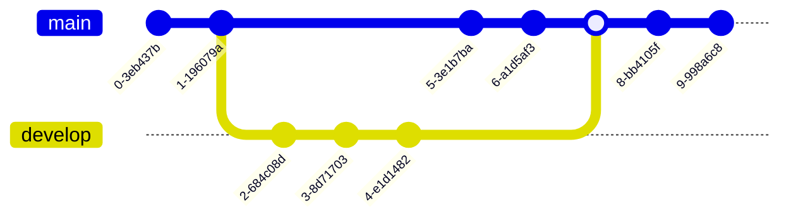
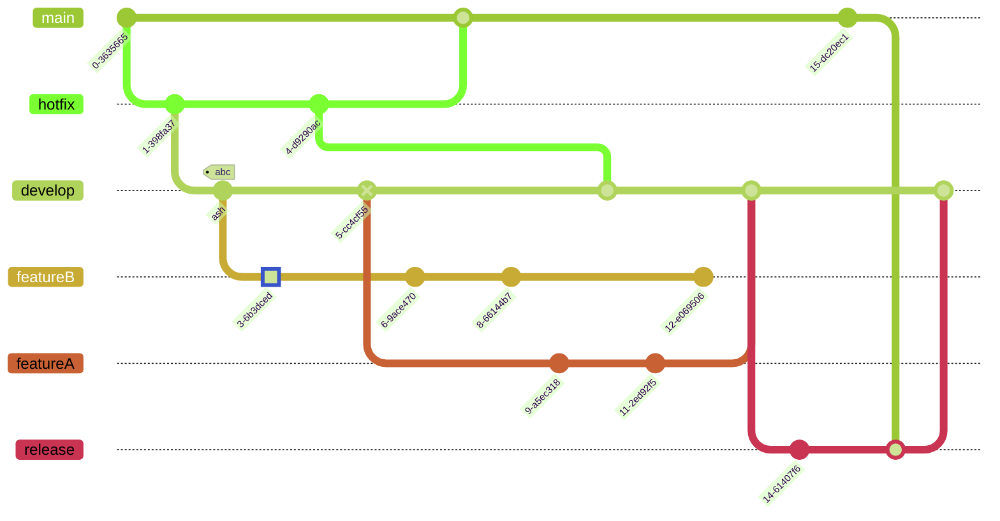

# Orientation (v10.3.0+)
In Mermaid, the default orientation is Left to Right. The branches are lined vertically.

Usage example:
## Code:
```markdown
gitGraph
       commit
       commit
       branch develop
       commit
       commit
       commit
       checkout main
       commit
       commit
       merge develop
       commit
       commit
```

Sometimes we may want to change the orientation. Currently, Mermaid supports two orientations: **Left to Right**(default) and **Top to Bottom**.

In order to change the orientation from top to bottom i.e. branches lined horizontally, you need to add `TB` along with `gitGraph`.

Usage example:
## Code:
```markdown
gitGraph TB:
       commit
       commit
       branch develop
       commit
       commit
       commit
       checkout main
       commit
       commit
       merge develop
       commit
       commit
```

# Themes
Mermaid supports a bunch of pre-defined themes which you can use to find the right one for you. PS: you can actually override an existing theme's variable to get your own custom theme going. Learn more about theming your diagram `here`.

The following are the different pre-defined theme options:
* base
* forest
* dark
* default
* neutral
**NOTE**: To change theme you can either use the ``initialize`` call or directives. Learn more about **directives** Let's put them to use, and see how our sample diagram looks in different themes:

# Base Theme
## Code:
```markdown
%%{init: { 'logLevel': 'debug', 'theme': 'base' } }%%
      gitGraph
        commit
        branch hotfix
        checkout hotfix
        commit
        branch develop
        checkout develop
        commit id:"ash" tag:"abc"
        branch featureB
        checkout featureB
        commit type:HIGHLIGHT
        checkout main
        checkout hotfix
        commit type:NORMAL
        checkout develop
        commit type:REVERSE
        checkout featureB
        commit
        checkout main
        merge hotfix
        checkout featureB
        commit
        checkout develop
        branch featureA
        commit
        checkout develop
        merge hotfix
        checkout featureA
        commit
        checkout featureB
        commit
        checkout develop
        merge featureA
        branch release
        checkout release
        commit
        checkout main
        commit
        checkout release
        merge main
        checkout develop
        merge release
```

# Forest Theme
## Code:
```markdown
%%{init: { 'logLevel': 'debug', 'theme': 'forest' } }%%
      gitGraph
        commit
        branch hotfix
        checkout hotfix
        commit
        branch develop
        checkout develop
        commit id:"ash" tag:"abc"
        branch featureB
        checkout featureB
        commit type:HIGHLIGHT
        checkout main
        checkout hotfix
        commit type:NORMAL
        checkout develop
        commit type:REVERSE
        checkout featureB
        commit
        checkout main
        merge hotfix
        checkout featureB
        commit
        checkout develop
        branch featureA
        commit
        checkout develop
        merge hotfix
        checkout featureA
        commit
        checkout featureB
        commit
        checkout develop
        merge featureA
        branch release
        checkout release
        commit
        checkout main
        commit
        checkout release
        merge main
        checkout develop
        merge release
```
