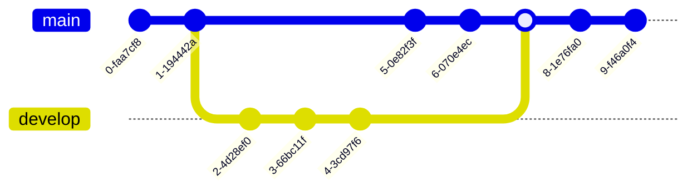
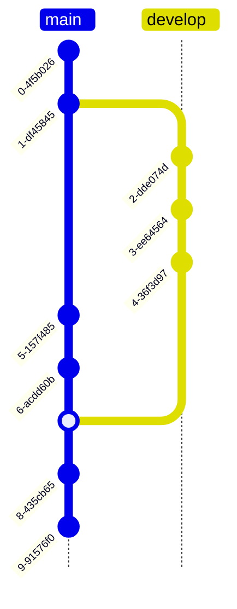
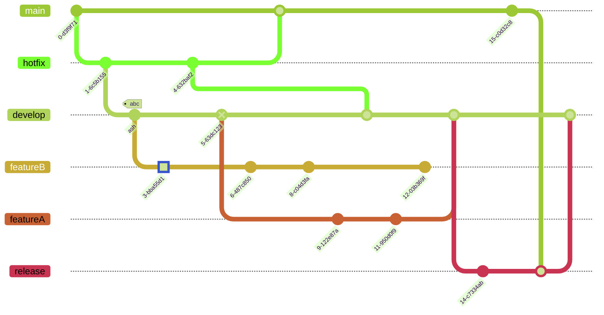
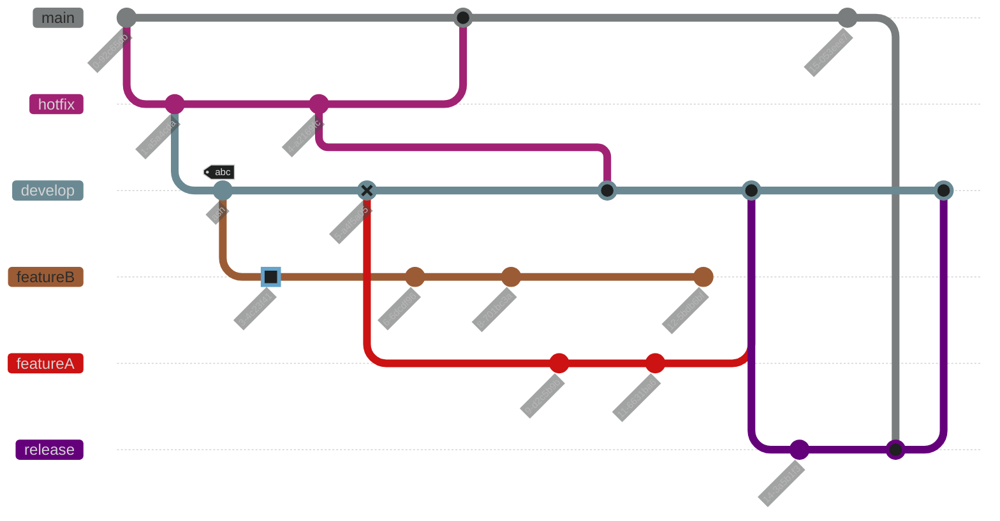
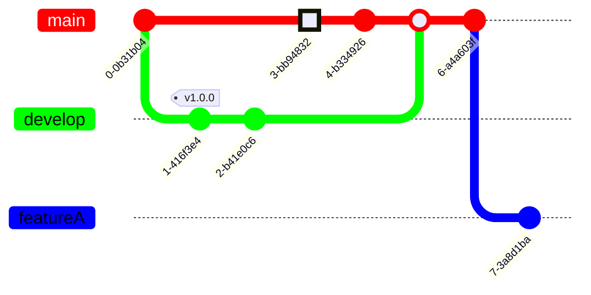

# Orientation (v10.3.0+)
In Mermaid, the default orientation is Left to Right. The branches are lined vertically.

Usage example:
## Code:
```markdown
gitGraph
       commit
       commit
       branch develop
       commit
       commit
       commit
       checkout main
       commit
       commit
       merge develop
       commit
       commit
```

Sometimes we may want to change the orientation. Currently, Mermaid supports two orientations: **Left to Right**(default) and **Top to Bottom**.

In order to change the orientation from top to bottom i.e. branches lined horizontally, you need to add `TB` along with `gitGraph`.

Usage example:
## Code:
```markdown
gitGraph TB:
       commit
       commit
       branch develop
       commit
       commit
       commit
       checkout main
       commit
       commit
       merge develop
       commit
       commit
```

# Themes
Mermaid supports a bunch of pre-defined themes which you can use to find the right one for you. PS: you can actually override an existing theme's variable to get your own custom theme going. Learn more about theming your diagram `here`.

The following are the different pre-defined theme options:
* base
* forest
* dark
* default
* neutral
**NOTE**: To change theme you can either use the ``initialize`` call or directives. Learn more about **directives** Let's put them to use, and see how our sample diagram looks in different themes:

# Base Theme
## Code:
```markdown
%%{init: { 'logLevel': 'debug', 'theme': 'base' } }%%
      gitGraph
        commit
        branch hotfix
        checkout hotfix
        commit
        branch develop
        checkout develop
        commit id:"ash" tag:"abc"
        branch featureB
        checkout featureB
        commit type:HIGHLIGHT
        checkout main
        checkout hotfix
        commit type:NORMAL
        checkout develop
        commit type:REVERSE
        checkout featureB
        commit
        checkout main
        merge hotfix
        checkout featureB
        commit
        checkout develop
        branch featureA
        commit
        checkout develop
        merge hotfix
        checkout featureA
        commit
        checkout featureB
        commit
        checkout develop
        merge featureA
        branch release
        checkout release
        commit
        checkout main
        commit
        checkout release
        merge main
        checkout develop
        merge release
```

# Forest Theme
## Code:
```markdown
%%{init: { 'logLevel': 'debug', 'theme': 'forest' } }%%
      gitGraph
        commit
        branch hotfix
        checkout hotfix
        commit
        branch develop
        checkout develop
        commit id:"ash" tag:"abc"
        branch featureB
        checkout featureB
        commit type:HIGHLIGHT
        checkout main
        checkout hotfix
        commit type:NORMAL
        checkout develop
        commit type:REVERSE
        checkout featureB
        commit
        checkout main
        merge hotfix
        checkout featureB
        commit
        checkout develop
        branch featureA
        commit
        checkout develop
        merge hotfix
        checkout featureA
        commit
        checkout featureB
        commit
        checkout develop
        merge featureA
        branch release
        checkout release
        commit
        checkout main
        commit
        checkout release
        merge main
        checkout develop
        merge release
```


# Default Theme
## Code:
```markdown
%%{init: { 'logLevel': 'debug', 'theme': 'default' } }%%
      gitGraph
        commit type:HIGHLIGHT
        branch hotfix
        checkout hotfix
        commit
        branch develop
        checkout develop
        commit id:"ash" tag:"abc"
        branch featureB
        checkout featureB
        commit type:HIGHLIGHT
        checkout main
        checkout hotfix
        commit type:NORMAL
        checkout develop
        commit type:REVERSE
        checkout featureB
        commit
        checkout main
        merge hotfix
        checkout featureB
        commit
        checkout develop
        branch featureA
        commit
        checkout develop
        merge hotfix
        checkout featureA
        commit
        checkout featureB
        commit
        checkout develop
        merge featureA
        branch release
        checkout release
        commit
        checkout main
        commit
        checkout release
        merge main
        checkout develop
        merge release
``` 


# Dark Theme
## Code:
```markdown 
%%{init: { 'logLevel': 'debug', 'theme': 'dark' } }%%
      gitGraph
        commit
        branch hotfix
        checkout hotfix
        commit
        branch develop
        checkout develop
        commit id:"ash" tag:"abc"
        branch featureB
        checkout featureB
        commit type:HIGHLIGHT
        checkout main
        checkout hotfix
        commit type:NORMAL
        checkout develop
        commit type:REVERSE
        checkout featureB
        commit
        checkout main
        merge hotfix
        checkout featureB
        commit
        checkout develop
        branch featureA
        commit
        checkout develop
        merge hotfix
        checkout featureA
        commit
        checkout featureB
        commit
        checkout develop
        merge featureA
        branch release
        checkout release
        commit
        checkout main
        commit
        checkout release
        merge main
        checkout develop
        merge release
```

# Neutral Theme
## Code:
```markdown
%%{init: { 'logLevel': 'debug', 'theme': 'neutral' } }%%
      gitGraph
        commit
        branch hotfix
        checkout hotfix
        commit
        branch develop
        checkout develop
        commit id:"ash" tag:"abc"
        branch featureB
        checkout featureB
        commit type:HIGHLIGHT
        checkout main
        checkout hotfix
        commit type:NORMAL
        checkout develop
        commit type:REVERSE
        checkout featureB
        commit
        checkout main
        merge hotfix
        checkout featureB
        commit
        checkout develop
        branch featureA
        commit
        checkout develop
        merge hotfix
        checkout featureA
        commit
        checkout featureB
        commit
        checkout develop
        merge featureA
        branch release
        checkout release
        commit
        checkout main
        commit
        checkout release
        merge main
        checkout develop
        merge release
```

# Customize using Theme Variables
Mermaid allows you to customize your diagram using theme variables which govern the look and feel of various elements of the diagram.

For understanding let us take a sample diagram with theme default, the `default` values of the theme variables is picked automatically from the theme. Later on we will see how to override the default values of the theme variables.

See how the **`default theme`** is used to set the colors for the branches:
## Code:
```markdown
%%{init: { 'logLevel': 'debug', 'theme': 'default' } }%%
       gitGraph
       commit
       branch develop
       commit tag:"v1.0.0"
       commit
       checkout main
       commit type: HIGHLIGHT
       commit
       merge develop
       commit
       branch featureA
       commit
```

> # IMPORTANT:
> Mermaid supports the theme variables to override the default values for **up to 8 branches**, i.e., you can set the color/styling of up to 8 branches using theme variables. After this threshold of 8 branches, the theme variables are reused in the cyclic manner, i.e. the 9th branch will use the color/styling of the 1st branch, or the branch at index position '8' will use the color/styling of the branch at index position '0'. More on this in the next section. See examples on **Customizing branch label colors** below

# Customizing branch colors
You can customize the branch colors using the `git0` to `git7` theme variables. Mermaid allows you to set the colors for up-to 8 branches, where `git0` variable will drive the value of the first branch, `git1` will drive the value of the second branch and so on.

NOTE: Default values for these theme variables are picked from the selected theme. If you want to override the default values, you can use the `initialize` call to add your custom theme variable values.

Example:

Now let's override the default values for the `git0` to `git3` variables:

## Code:
```markdown
%%{init: { 'logLevel': 'debug', 'theme': 'default' , 'themeVariables': {
              'git0': '#ff0000',
              'git1': '#00ff00',
              'git2': '#0000ff',
              'git3': '#ff00ff',
              'git4': '#00ffff',
              'git5': '#ffff00',
              'git6': '#ff00ff',
              'git7': '#00ffff'
       } } }%%
       gitGraph
       commit
       branch develop
       commit tag:"v1.0.0"
       commit
       checkout main
       commit type: HIGHLIGHT
       commit
       merge develop
       commit
       branch featureA
       commit
```

See how the branch colors are changed to the values specified in the theme variables.