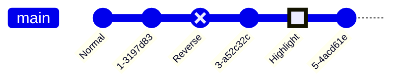
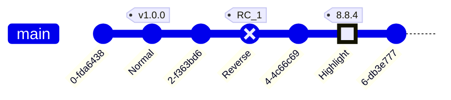

# Gitgraph Diagrams
> A Git Graph is a pictorial representation of git commits and git actions(commands) on various branches.
These kind of diagram are particularly helpful to developers and devops teams to share their Git branching strategies. For example, it makes it easier to visualize how git flow works.
Mermaid can render Git diagrams
## Code:
```markdown
---
title: Example Git diagram
---
gitGraph
   commit
   commit
   branch develop
   checkout develop
   commit
   commit
   checkout main
   merge develop
   commit
   commit
```

In Mermaid, we support the basic git operations like:
* commit : Representing a new commit on the current branch.
* branch : To create & switch to a new branch, setting it as the current branch.
* checkout : To checking out an existing branch and setting it as the current branch.
* merge : To merge an existing branch onto the current branch.
With the help of these key git commands, you will be able to draw a gitgraph in Mermaid very easily and quickly. Entity names are often capitalized, although there is no accepted standard on this, and it is not required in Mermaid.
# Syntax
Mermaid syntax for a gitgraph is very straight-forward and simple. It follows a declarative-approach, where each commit is drawn on the timeline in the diagram, in order of its occurrences/presence in code. Basically, it follows the insertion order for each command.

First thing you do is to declare your diagram type using the gitgraph keyword. This gitgraph keyword, tells Mermaid that you wish to draw a `gitgraph`, and parse the diagram code accordingly.

Each gitgraph, is initialized with main branch. So unless you create a different branch, by-default the commits will go to the main branch. This is driven with how git works, where in the beginning you always start with the `main` branch (formerly called as master branch). And by-default, main branch is set as your current branch.

You make use of commit keyword to register a commit on the current branch. Let see how this works:

A simple gitgraph showing three commits on the default (main) branch:
## Code:
```markdown
gitGraph
       commit
       commit
       commit
```

If you look closely at the previous example, you can see the default branch main along with three commits. Also, notice that by default each commit has been given a unique & random ID. What if you wanted to give your own custom ID to a commit? Yes, it is possible to do that with Mermaid.
# Adding custom commit id
For a given commit you may specify a custom ID at the time of declaring it using the `id` attribute, followed by `:` and your custom value within a `""` quote. For example: `commit id: "your_custom_id"`

Let us see how this works with the help of the following diagram:
## Code:
```markdown
gitGraph
       commit id: "Alpha"
       commit id: "Beta"
       commit id: "Gamma"
```

In this example, we have given our custom IDs to the commits.
# Modifying commit type
In Mermaid, a commit can be of three type, which render a bit different in the diagram. These types are:

* `NORMAL` : Default commit type. Represented by a solid circle in the diagram
* `REVERSE` : To emphasize a commit as a reverse commit. Represented by a crossed solid circle in the diagram.
* `HIGHLIGHT` : To highlight a particular commit in the diagram. Represented by a filled rectangle in the diagram.
For a given commit you may specify its type at the time of declaring it using the `type` attribute, followed by `:` and the required type option discussed above. For example: `commit type: HIGHLIGHT`

NOTE: If no commit type is specified, `NORMAL` is picked as default.

Let us see how these different commit type look with the help of the following diagram:
## Code:
```markdown
gitGraph
       commit id: "Normal"
       commit
       commit id: "Reverse" type: REVERSE
       commit
       commit id: "Highlight" type: HIGHLIGHT
       commit
```

In this example, we have specified different types to each commit. Also, see how we have included both `id` and `type` together at the time of declaring our commits.
# Adding Tags
For a given commit you may decorate it as a tag, similar to the concept of tags or release version in git world. You can attach a custom tag at the time of declaring a commit using the `tag` attribute, followed by `:` and your custom value within `""` quote. For example: `commit tag: "your_custom_tag"`

Let us see how this works with the help of the following diagram:
## Code:
```markdown
gitGraph
       commit
       commit id: "Normal" tag: "v1.0.0"
       commit
       commit id: "Reverse" type: REVERSE tag: "RC_1"
       commit
       commit id: "Highlight" type: HIGHLIGHT tag: "8.8.4"
       commit
```
